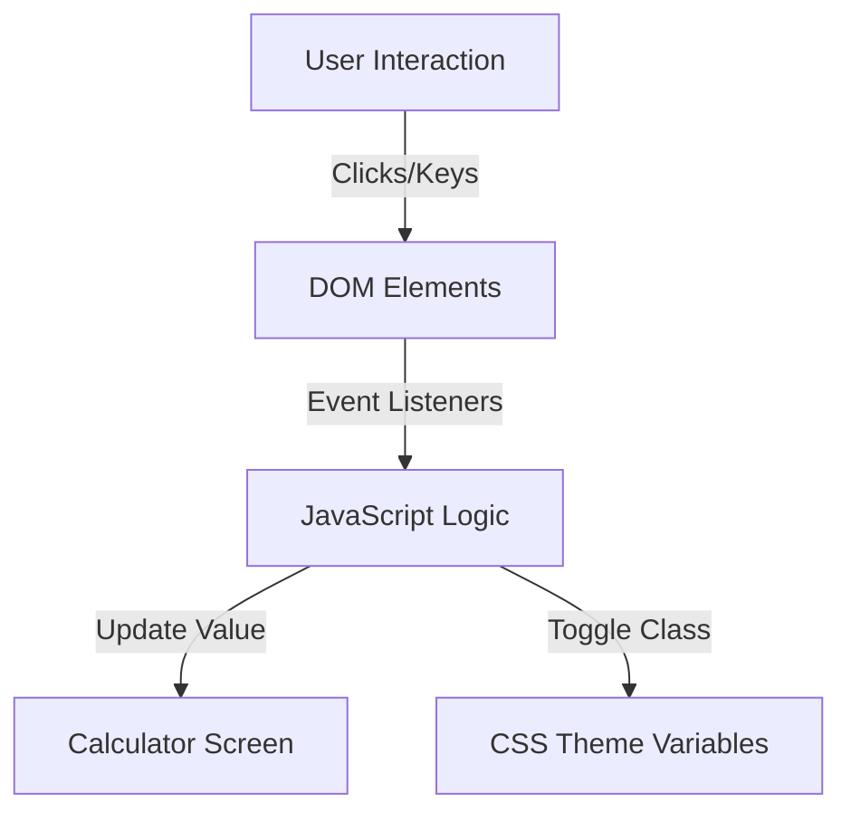

# Calculator - Simple & Dark Mode Compatible


### A Modern, Theme-Aware Calculator Application

A clean and efficient calculator built with **HTML5**, **CSS3**, and **Vanilla JavaScript**. This application offers a seamless user experience with instant calculations, keyboard support, and a toggleable dark/light mode interface.

---

## 📋 Table of Contents
- [About](#-about)
- [Features](#-features)
- [Tech Stack](#-tech-stack)
- [Architecture](#-architecture)
- [Installation](#-installation)
- [Usage](#-usage)
- [Contributing](#-contributing)
- [License](#-license)

---

## 📖 About

**Calculator** is a lightweight web application designed to perform basic arithmetic operations with ease. It features a responsive design that works across devices and includes a user-friendly theme switcher to reduce eye strain during night-time usage.

The system enables users to:
- Perform calculations (Addition, Subtraction, Multiplication, Division)
- Switch between Light and Dark themes dynamically
- Use keyboard inputs for faster operation
- View clear result history within the session

---

## ✨ Features

### Core Functionality
- **Arithmetic Operations**: Standard calculation capabilities including decimal support.
- **Theme Switching**: One-click toggle between Dark and Light modes with persistent state during session.
- **Keyboard Support**: Full keyboard integration for number entry, operators, and result calculation.
- **Responsive UI**: Adapts gracefully to different screen sizes.
- **Toast Notifications**: Visual feedback when switching themes.

### Advanced Features
- **Live Screen Updates**: Real-time display of entered values.
- **Error Handling**: Graceful handling of invalid operations (e.g., division by zero).
- **Input Validation**: Prevents invalid character inputs via keyboard.

---

## 🛠 Tech Stack

### Frontend
| Technology | Description |
|------------|-------------|
| **HTML5** | Semantic structure of the application |
| **CSS3** | Custom styling with CSS Variables for theming |
| **JavaScript** | Core logic for calculations and DOM manipulation |

### Development Tools
- **VS Code** - IDE
- **Git** - Version control

---

## 🏗 Architecture

The project follows a simple client-side architecture:



### Project Structure
```
Calculator-master/
├── index.html                     # Main application structure
├── README.md                      # Project documentation
├── assets/                        # Images and icons
│   ├── Calculator.png
│   ├── GitHubDark.svg
│   ├── GitHubLight.svg
│   ├── MoonIcon.svg
│   └── SunIcon.svg
├── scripts/                       # Application logic
│   └── script.js                  # Calc & Theme functions
└── styles/                        # Styling files
    ├── dark.css                   # Dark theme variables
    └── light.css                  # Light theme variables
```

---

## � Installation

### Prerequisites
- A modern web browser (Chrome, Firefox, Edge, Safari)

### Setup
1. **Clone the repository**
   ```bash
   git clone https://github.com/zxcodes/JavaScript-Calculator.git
   ```

2. **Navigate to project directory**
   ```bash
   cd JavaScript-Calculator
   ```

3. **Launch the Application**
   - Simply open `index.html` in your web browser.
   - Or use a live server extension in VS Code.

---

## � Usage

### Basic Operations
1. **Click Buttons**: Use the on-screen keypad to enter numbers and operators.
2. **Keyboard**: Type directly on your physical keyboard.
   - `Enter` = Calculate result (`=`)
   - `Backspace` = Clear last digit
   - `c` = Clear screen (if mapped) or use on-screen button

### Theme Toggle
- Click the **Sun/Moon icon** in the top right corner to switch between **Light Mode** and **Dark Mode**.
- A toast message will appear confirming the mode change.

---

## 🤝 Contributing

We welcome contributions to improve this calculator! Please follow these steps:

1. Fork the repository
2. Create a feature branch (`git checkout -b feature/AmazingFeature`)
3. Commit your changes (`git commit -m 'Add some AmazingFeature'`)
4. Push to the branch (`git push origin feature/AmazingFeature`)
5. Open a Pull Request

---

## 📄 License

This project is licensed under the MIT License.

MIT License

Copyright (c) 2022 ZxCodes

Permission is hereby granted, free of charge, to any person obtaining a copy
of this software and associated documentation files (the "Software"), to deal
in the Software without restriction, including without limitation the rights
to use, copy, modify, merge, publish, distribute, sublicense, and/or sell
copies of the Software, and to permit persons to whom the Software is
furnished to do so, subject to the following conditions:

The above copyright notice and this permission notice shall be included in all
copies or substantial portions of the Software.

THE SOFTWARE IS PROVIDED "AS IS", WITHOUT WARRANTY OF ANY KIND, EXPRESS OR
IMPLIED, INCLUDING BUT NOT LIMITED TO THE WARRANTIES OF MERCHANTABILITY,
FITNESS FOR A PARTICULAR PURPOSE AND NONINFRINGEMENT.

---

Built with ❤️ for simple and effective calculations.
